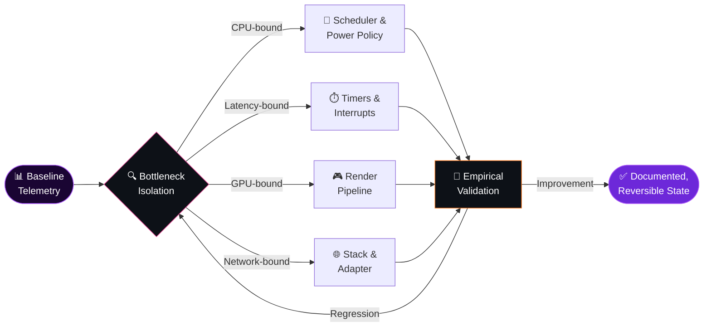

<div align="center">


<a href="https://octaviantweaking.com">
  
</a>


<br/>


<a href="https://github.com/OctavianAdv?tab=followers"></a>
<a href="https://octaviantweaking.com"></a>
<a href="https://davidenko.ro"></a>

<br/><br/>


</div>


## 🧬 Manifesto

I am a **systems engineer, performance architect, and full-stack developer** from Romania 🇷🇴, operating at the intersection where silicon, operating-system heuristics, and human perception converge.

My work is predicated on a singular, uncompromising thesis: **the overwhelming majority of consumer machines operate substantially beneath their architectural potential** — throttled not by insufficient hardware, but by conservative vendor defaults, indiscriminate telemetry, power-management heuristics optimized for battery longevity rather than responsiveness, and decades of accumulated operating-system entropy.

I approach optimization not as a collection of folkloric registry tweaks, but as an **empirical, measurement-driven engineering discipline** — isolating bottlenecks with forensic precision, intervening surgically, and validating every modification against reproducible telemetry. Frametime variance, DPC/ISR latency, input-to-photon delay, and network jitter are not abstractions to me; they are the quantifiable adversaries I dismantle.

> *"If it runs, it can run faster."*
> — and if it runs faster, it can run **more consistently**. Consistency is the true currency of performance.


## ⚡ `whoami`

```typescript
interface PerformanceArchitect {
  readonly identity:    "Octavian";
  readonly origin:      "Romania 🇷🇴";
  readonly disciplines: readonly string[];
  readonly doctrine:    string;
}

export const octavian: PerformanceArchitect & Record<string, unknown> = {
  identity:    "Octavian",
  origin:      "Romania 🇷🇴",
  disciplines: [
    "Low-latency Windows systems engineering",
    "Interrupt topology & scheduler heuristics",
    "Frame-pacing forensics & input-latency minimization",
    "Network stack determinism",
    "Full-stack web architecture",
    "Linux server administration & reverse-proxy infrastructure",
  ],
  enterprise:  "Octavian Tweaking — bespoke PC optimization & performance engineering",
  flagship:    "Octavian Tweaking Utility (OTU)",
  academia:    "B.Sc. Computer Science — Universitatea 1 Decembrie 1918",
  broadcast:   ["TikTok", "YouTube", "Instagram", "Kick"],
  doctrine:    "Measure. Isolate. Intervene. Validate. Never assume.",
};
```


## ⚙️ Flagship — Octavian Tweaking Utility

<div align="center">


**A comprehensive, holistic performance-orchestration suite for Windows** — consolidating system-level, network-level, and input-level optimization into a single, coherent, meticulously engineered instrument.

<a href="https://octaviantweaking.com"></a>
<a href="https://discord.gg/BBtwEREjmj"></a>

</div>

| Subsystem | Intervention Vector | Engineering Objective |
|:--|:--|:--|
| 🧠 **Processor & Scheduler** | Quantum configuration, core-parking suppression, idle-state governance | Maximize foreground-thread responsiveness and eradicate wake-up latency |
| ⏱️ **Timers & Interrupts** | Timer-resolution coercion, MSI delivery, interrupt-affinity pinning | Deterministic interrupt servicing with minimal DPC/ISR jitter |
| 🎮 **Graphics Pipeline** | Presentation-model optimization, driver debloating, scheduler configuration | Low-variance frame delivery and reduced render-queue depth |
| 🧮 **Memory Subsystem** | Standby-list governance, paging-policy calibration | Eliminate cache-eviction stutter and allocation stalls |
| 🌐 **Network Stack** | Nagle neutralization, RSS balancing, adapter power-saving eradication | Minimize packet-coalescing delay and jitter in real-time traffic |
| 🖱️ **Input Path** | Raw-input validation, acceleration removal, USB power-policy correction | Faithful, one-to-one, latency-minimized peripheral input |
| 🧹 **Operating System** | Telemetry suppression, service rationalization, scheduled-task pruning | Reclaim CPU cycles, I/O bandwidth, and memory from background entropy |


## 🔬 Methodology — The Optimization Lifecycle



Every modification traverses this lifecycle. **Nothing is applied on faith.** Each intervention is benchmarked against a controlled baseline, scrutinized for regressions, and remains fully reversible.

<div align="center">

</div>


## 📚 The Optimization Doctrine

<sub>An encyclopedic compendium of the domains I engineer. Expand any section.</sub>

<details>
<summary><b>🧠 Processor, Scheduler & Power Management</b></summary>
<br/>

The Windows scheduler is a general-purpose arbiter, calibrated for fairness across heterogeneous workloads — not for the latency-critical, single-application determinism that competitive gaming demands.

| Parameter | Mechanism | Rationale |
|:--|:--|:--|
| `Win32PrioritySeparation` | Governs quantum length, variability, and foreground boost | Shapes how aggressively the foreground process is favored over background threads |
| **Core Parking** | Dynamically consolidates load onto fewer cores | Unparking eliminates the latency penalty of re-awakening dormant cores |
| **Processor Idle States (C-states)** | Progressively deeper power-saving sleep states | Deep C-states impose exit latency; constraining them yields snappier wake-ups |
| **Energy Performance Preference** | Hints the CPU's internal frequency governor | Biasing toward performance expedites frequency ramp-up under burst loads |
| **Heterogeneous / SMT Topology** | P-core/E-core and logical-sibling awareness | Ensures latency-sensitive threads land on the most capable execution resources |
| **Custom Power Plans** | Consolidated processor power-management policy | Replaces battery-oriented heuristics with throughput- and latency-oriented ones |

</details>

<details>
<summary><b>⏱️ Timer Resolution, Clock Sources & Interrupt Topology</b></summary>
<br/>

Latency is fundamentally a function of **how quickly and how predictably** the system responds to events. Timers and interrupts are the nervous system of that responsiveness.

| Parameter | Mechanism | Rationale |
|:--|:--|:--|
| **Global Timer Resolution** | `NtSetTimerResolution` — default ≈15.6 ms granularity | Finer resolution (e.g. 0.5 ms) tightens sleep precision and frame-limiter accuracy |
| **Dynamic Tick** | `bcdedit /set disabledynamictick yes` | Prevents the kernel from coalescing timer ticks during perceived idleness |
| **Platform Clock** | TSC vs. HPET selection via `useplatformclock` | Avoids forcing the comparatively expensive HPET as the primary clock source |
| **MSI / MSI-X Mode** | Message-Signaled Interrupts replace legacy line-based IRQs | Reduces interrupt-sharing contention and servicing overhead |
| **Interrupt Affinity** | Pins device interrupts to designated cores | Isolates GPU, NIC, and USB servicing from the game's critical threads |
| **DPC / ISR Latency** | Deferred Procedure Call & Interrupt Service Routine execution time | The primary diagnostic metric for micro-stutter and audio crackling |

</details>

<details>
<summary><b>🎮 Graphics Pipeline, Presentation & Frame Pacing</b></summary>
<br/>

Average FPS is a vanity metric. **Frametime consistency and 1% / 0.1% lows** are what the human visual system actually perceives.

| Parameter | Mechanism | Rationale |
|:--|:--|:--|
| **Presentation Model** | Flip-model, independent flip, legacy exclusive fullscreen | Bypassing composition overhead reduces presentation latency |
| **HAGS** | Hardware-Accelerated GPU Scheduling | Offloads VRAM scheduling to the GPU; benefit is workload- and driver-dependent |
| **Render Queue Depth** | Low-latency modes / Reflex / Anti-Lag | Shrinks pre-rendered frame buffering to curtail input latency |
| **Multiplane Overlay (MPO)** | Hardware composition planes | Can induce flicker/stutter on certain configurations; evaluated case-by-case |
| **Shader Cache** | Persistent compiled-shader storage | Adequately sized caches mitigate compilation stutter |
| **Driver Hygiene** | Minimal driver installation, telemetry excision | Eliminates superfluous components, services, and overlays |

</details>

<details>
<summary><b>🧮 Memory Subsystem</b></summary>
<br/>

| Parameter | Mechanism | Rationale |
|:--|:--|:--|
| **Standby List** | Cached memory retained for rapid re-use | Pathological standby-list growth can precipitate allocation stalls and stutter |
| **XMP / EXPO** | Rated memory profiles in firmware | Unenabled profiles leave memory at conservative JEDEC frequencies and timings |
| **Primary & Secondary Timings** | tCL, tRCD, tRP, tRAS, tRFC, tREFI | Manual calibration reduces effective memory latency beyond stock profiles |
| **Memory Compression** | Kernel-level page compression | Trades CPU cycles for capacity; context-dependent value |
| **Page File Policy** | Virtual-memory backing store | Calibrated sizing prevents commit-limit exhaustion without wasteful I/O |

</details>

<details>
<summary><b>🌐 Network Stack Determinism</b></summary>
<br/>

In real-time multiplayer environments, **jitter is more pernicious than raw ping**. A stable 30 ms outperforms an erratic 15 ms.

| Parameter | Mechanism | Rationale |
|:--|:--|:--|
| **Nagle's Algorithm** | `TcpAckFrequency` / `TCPNoDelay` | Disables small-packet coalescing that introduces transmission delay |
| **Receive-Side Scaling (RSS)** | Distributes packet processing across cores | Prevents single-core network-processing saturation |
| **Interrupt Moderation** | NIC-level interrupt batching | Trading throughput efficiency for per-packet responsiveness |
| **Adapter Power Saving** | Energy-Efficient Ethernet, Green Ethernet, selective suspend | Eradicates link-state transitions and wake latency |
| **Flow Control** | Ethernet PAUSE frames | Can introduce unpredictable transmission stalls |
| **Bufferbloat** | Excessive queueing in routers/modems | Mitigated via Smart Queue Management (SQM) and QoS discipline |

</details>

<details>
<summary><b>🖱️ Input Path Fidelity</b></summary>
<br/>

| Parameter | Mechanism | Rationale |
|:--|:--|:--|
| **Enhance Pointer Precision** | Windows pointer-acceleration curve | Non-linear acceleration corrupts muscle-memory consistency |
| **Raw Input** | Direct HID data, bypassing the pointer ballistics pipeline | Guarantees one-to-one sensor-to-cursor translation |
| **Polling Rate** | 1000 / 2000 / 4000 / 8000 Hz | Higher rates shrink reporting intervals at the cost of CPU overhead |
| **USB Selective Suspend** | Per-port power management | Prevents peripherals from entering power-saving states mid-session |
| **USB Controller Topology** | Device placement across xHCI controllers | Segregating high-polling peripherals minimizes controller contention |

</details>

<details>
<summary><b>🧹 Operating-System Rationalization</b></summary>
<br/>

| Domain | Intervention | Rationale |
|:--|:--|:--|
| **Telemetry** | Diagnostic-data pipelines, CEIP, error reporting | Reclaims CPU, disk I/O, and network bandwidth |
| **Services** | Rationalization of superfluous background services | Diminishes context-switching pressure and memory footprint |
| **Scheduled Tasks** | Pruning of maintenance and telemetry tasks | Prevents unpredictable mid-session background activity |
| **Background Applications** | UWP background execution policy | Curtails resource contention from dormant applications |
| **Security Trade-offs** | VBS / HVCI / CPU mitigations | Measurable overhead — **documented transparently, never altered silently** |

</details>

<details>
<summary><b>🔩 Firmware & BIOS Engineering</b></summary>
<br/>

| Parameter | Mechanism | Rationale |
|:--|:--|:--|
| **Resizable BAR** | Full VRAM addressability by the CPU | Enhances asset-transfer efficiency in supported titles |
| **PBO / Curve Optimizer** | Per-core voltage-frequency curve calibration (AMD) | Elevates sustained boost clocks within thermal and electrical limits |
| **Undervolting** | Reduced voltage at equivalent frequency | Lower thermals → higher sustained boost → greater consistency |
| **Unused Controllers** | Disabling superfluous onboard devices | Eliminates spurious interrupts and driver overhead |
| **Firmware C-state Policy** | Platform-level idle-state configuration | Complements OS-level latency governance |

</details>

<details>
<summary><b>📐 Instrumentation & Benchmarking Protocol</b></summary>
<br/>

```text
┌───────────────────────────────────────────────────────────────────────┐
│  PROTOCOL: EMPIRICAL VALIDATION                                        │
├───────────────────────────────────────────────────────────────────────┤
│  01 │ Establish a controlled baseline — identical scene, settings,     │
│     │ resolution, thermal equilibrium, and background state.           │
│  02 │ Capture frametimes (PresentMon / CapFrameX) across ≥3 passes.    │
│  03 │ Profile DPC/ISR latency (LatencyMon, Windows Performance         │
│     │ Recorder + Windows Performance Analyzer / xperf).                │
│  04 │ Apply ONE intervention at a time — never confound variables.     │
│  05 │ Re-capture. Compare averages, 1% lows, 0.1% lows, variance.      │
│  06 │ Retain only statistically meaningful improvements.               │
│  07 │ Document. Snapshot. Guarantee reversibility.                     │
└───────────────────────────────────────────────────────────────────────┘
```

</details>


## 🚀 Additional Engineering

<table>
<tr>
<td width="50%" valign="top">

### 🖱️ MouseFix
A **low-level input-path remediation utility** operating at the kernel-driver layer — engineered to guarantee unadulterated, acceleration-free, one-to-one mouse input with no smoothing artifacts.


</td>
<td width="50%" valign="top">

### 🎮 NEXON
A **full-stack e-commerce platform** for bespoke controllers and competitive gaming peripherals — integrated payment orchestration, contemporary design language, and performance-first architecture.


</td>
</tr>
</table>


## 🛠️ Technological Arsenal

<div align="center">

**Systems & Scripting Languages**<br/>


**Frontend & Backend Frameworks**<br/>


**Data, Infrastructure & Operations**<br/>


**Engineering Toolchain**<br/>


</div>


## 📊 Telemetry

<div align="center">


<picture>
  <source media="(prefers-color-scheme: dark)" srcset="https://raw.githubusercontent.com/OctavianAdv/OctavianAdv/output/github-snake-dark.svg" />
  <source media="(prefers-color-scheme: light)" srcset="https://raw.githubusercontent.com/OctavianAdv/OctavianAdv/output/github-snake.svg" />
  
</picture>

</div>


## 🌐 Transmission Channels

<div align="center">

<a href="https://instagram.com/octaviantweaks"></a>
<a href="https://tiktok.com/@octavianxoc"></a>
<a href="https://youtube.com/@octavianxoc"></a>
<a href="https://kick.com/octavianxoc"></a>
<a href="https://discord.gg/BBtwEREjmj"></a>

<br/><br/>


</div>


