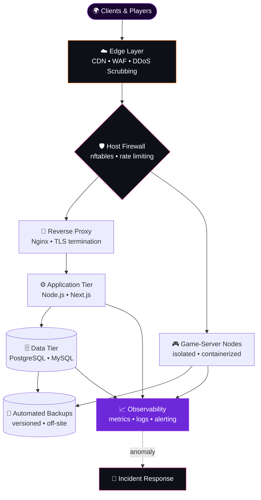

<div align="center">


<a href="https://octaviantweaking.com">
  
</a>


<br/>


<a href="https://github.com/OctavianAdv?tab=followers"></a>
<a href="https://octaviantweaking.com"></a>
<a href="https://davidenko.ro"></a>

</div>


## 🧬 Manifesto

I am a **polymathic software engineer, multi-distribution Linux systems administrator, game-hosting platform architect, security practitioner, and performance engineer** from Romania 🇷🇴 — operating at the confluence where source code, operating-system internals, network infrastructure, and adversarial threat models intersect.

My professional ethos rests upon a deliberately uncompromising premise: **every system — whether a competitive gaming workstation, a production web platform, or a fleet of multiplayer game servers — can be rendered faster, leaner, more deterministic, and more resilient than its default state permits.** Vendor defaults are, by necessity, calibrated for the lowest common denominator; my discipline is the systematic, evidence-based transcendence of those defaults.

I refuse to treat engineering as a collection of isolated specialisms. Performance without security is recklessness; security without availability is paralysis; availability without observability is blind faith. I therefore approach every undertaking **holistically** — conceiving, implementing, deploying, hardening, monitoring, and continuously refining the entire lifecycle, from the first line of code to the last packet traversing the wire.

> *"If it runs, it can run faster."*
> — and if it runs faster, it must also run **safer, steadier, and longer**.


## ⚡ `whoami`

```typescript
interface Engineer {
  readonly identity:    string;
  readonly origin:      string;
  readonly disciplines: Record<string, readonly string[]>;
  readonly doctrine:    string;
}

export const octavian: Engineer = {
  identity: "Octavian",
  origin:   "Romania 🇷🇴",
  disciplines: {
    softwareEngineering: ["C", "C++", "C#/.NET", "TypeScript", "Python", "PowerShell", "Bash"],
    webArchitecture:     ["Next.js", "React", "Angular", "Node.js", "Express", "PostgreSQL", "MySQL"],
    linuxAdministration: ["Ubuntu", "Debian", "Rocky Linux", "AlmaLinux", "Fedora", "Arch Linux"],
    hostingPlatforms:    ["Dedicated & virtualized servers", "Control panels", "Game-server orchestration"],
    cyberSecurity:       ["System hardening", "Network defense", "DDoS mitigation", "Incident response"],
    performance:         ["Windows internals", "Interrupt topology", "Latency & frame-pacing forensics"],
  },
  doctrine: "Measure. Isolate. Harden. Automate. Validate. Never assume.",
};
```


## 🗺️ Domains of Mastery

<div align="center">

| | Domain | Scope of Expertise |
|:--:|:--|:--|
| 💻 | **Software Engineering** | Systems programming, desktop tooling, full-stack web platforms, automation and scripting across heterogeneous runtimes |
| 🐧 | **Linux Systems Administration** | Provisioning, configuration, hardening, and lifecycle stewardship across Debian-based, RHEL-based, and rolling-release distributions |
| 🎮 | **Game-Hosting Platform Engineering** | Architecting, deploying, and operating multiplayer infrastructure with emphasis on tick-rate stability and availability |
| 🛡️ | **Cyber Security** | Defensive architecture, attack-surface reduction, threat mitigation, vulnerability assessment, and incident response |
| 🌐 | **Infrastructure & Networking** | Reverse proxies, TLS termination, DNS, CDN integration, firewalling, and traffic engineering |
| ⚙️ | **Performance Engineering** | Low-latency Windows optimization, scheduler heuristics, interrupt topology, and frame-pacing analysis |

</div>


## 🏛️ Infrastructure Philosophy — Reference Architecture



**Defense in depth, layered by design.** Each tier presumes the compromise of the tier preceding it, constraining blast radius and ensuring that no single failure — accidental or adversarial — cascades into systemic collapse.


## 🐧 Linux Systems Administration

<div align="center">


</div>

Fluency across distribution families is not merely a matter of memorizing divergent package managers — it is an intimate understanding of their **differing philosophies of stability, release cadence, default security posture, and init-system conventions**.

<details>
<summary><b>📦 Distribution Families & Operational Nuance</b></summary>
<br/>

| Family | Representatives | Package Ecosystem | Operational Character |
|:--|:--|:--|:--|
| **Debian-based** | Debian, Ubuntu | `apt` / `dpkg` | Conservative stability (Debian) or predictable LTS cadence (Ubuntu); AppArmor by default |
| **RHEL-based** | Rocky Linux, AlmaLinux, CentOS | `dnf` / `rpm` | Enterprise longevity, binary compatibility, SELinux enforcing by default |
| **Fedora** | Fedora Server / Workstation | `dnf` / `rpm` | Upstream-proximate innovation; proving ground for enterprise technologies |
| **Rolling-release** | Arch Linux | `pacman` / AUR | Bleeding-edge currency; demands disciplined, deliberate maintenance |

</details>

<details>
<summary><b>⚙️ Core Administrative Competencies</b></summary>
<br/>

| Discipline | Instruments | Objective |
|:--|:--|:--|
| **Service Orchestration** | `systemd` units, timers, dependency ordering | Deterministic, self-healing service lifecycles |
| **Storage Engineering** | LVM, RAID, ext4, XFS, mount-option tuning | Resilient, performant, and extensible storage layouts |
| **Kernel Tuning** | `sysctl`, I/O schedulers, network buffers, file-descriptor limits | Calibrating the kernel for the specific workload rather than the generic case |
| **Web Serving** | Nginx, Apache, reverse proxying, TLS via ACME | Secure, efficient, horizontally composable HTTP delivery |
| **Databases** | PostgreSQL, MySQL/MariaDB — tuning, replication, backup | Durable, consistent, and performant persistence |
| **Containerization** | Docker, Compose, resource constraints, network isolation | Reproducible deployments with bounded blast radius |
| **Automation** | Bash, cron, systemd timers, scripted provisioning | Eradicating toil and human error through idempotent automation |
| **Observability** | Journald, log rotation, resource metrics, alerting | Perceiving degradation before it becomes an outage |
| **Control Panels** | HestiaCP and comparable hosting panels | Multi-tenant web, mail, and DNS administration at scale |

</details>


## 🎮 Game-Hosting Platform Engineering

In multiplayer environments, infrastructure quality is **directly perceptible** to every player. A dropped tick, a garbage-collection pause, or a volumetric flood is not an abstract incident — it is a ruined match. I engineer hosting environments accordingly.

<details>
<summary><b>🕹️ Platform Architecture & Operations</b></summary>
<br/>

| Dimension | Approach | Rationale |
|:--|:--|:--|
| **Bare-Metal Provisioning** | Dedicated servers with calibrated CPU governors and kernel parameters | Game servers are frequently single-thread-bound; clock stability eclipses core count |
| **Server Software** | Paper/PaperMC and performance-oriented forks, proxy layers for networks | Asynchronous chunk processing and optimized tick loops sustain higher player density |
| **JVM Engineering** | Heap sizing, garbage-collector selection and flag calibration | Minimizes stop-the-world pauses that manifest as in-game lag spikes |
| **Tenant Isolation** | Containerization, per-instance resource quotas, dedicated users | Prevents a single misbehaving instance from starving its neighbors |
| **Management Panels** | Web-based game-server panels with daemon-per-node topology | Delegated, auditable administration without granting shell access |
| **Network Resilience** | Upstream DDoS scrubbing, protocol-aware filtering, connection throttling | Game protocols are prime volumetric and state-exhaustion targets |
| **Data Durability** | Scheduled, versioned, off-site world and database backups | Recovery objectives measured in minutes, not days |
| **Performance Profiling** | Tick-time analysis, TPS/MSPT monitoring, plugin profiling | Pinpointing the precise code path responsible for degradation |

</details>


## 🛡️ Cyber Security & Defensive Engineering

<div align="center">


</div>

Security is not a product one installs; it is an **emergent property of disciplined architecture**. I practice it through the lens of the adversary — anticipating reconnaissance, enumerating attack vectors, and dismantling them before they can be weaponized.

<details>
<summary><b>🔐 Host Hardening</b></summary>
<br/>

| Control | Implementation | Threat Neutralized |
|:--|:--|:--|
| **SSH Hardening** | Key-only authentication, root login disabled, non-default exposure, restricted ciphers | Credential brute-forcing and opportunistic scanning |
| **Principle of Least Privilege** | Granular `sudo` policies, dedicated service accounts, restrictive permissions | Lateral movement and privilege escalation |
| **Mandatory Access Control** | SELinux / AppArmor enforcement profiles | Post-exploitation containment |
| **Patch Governance** | Disciplined update cadence, unattended security updates | Exploitation of publicly disclosed vulnerabilities |
| **Service Minimization** | Disabling and removing every non-essential daemon | Attack-surface proliferation |
| **Integrity & Auditing** | `auditd`, file-integrity monitoring, centralized logging | Undetected tampering and persistence |

</details>

<details>
<summary><b>🌐 Network Defense</b></summary>
<br/>

| Control | Implementation | Threat Neutralized |
|:--|:--|:--|
| **Stateful Firewalling** | nftables / iptables / UFW with default-deny ingress | Unsolicited exposure of internal services |
| **Intrusion Prevention** | Fail2ban / CrowdSec behavioral banning | Automated brute-force and abusive clients |
| **DDoS Mitigation** | Edge scrubbing, rate limiting, SYN cookies, connection caps | Volumetric, protocol, and application-layer floods |
| **Web Application Firewall** | Edge and reverse-proxy rule sets | Injection, traversal, and automated exploitation attempts |
| **Transport Security** | Modern TLS configuration, HSTS, certificate automation | Interception and downgrade attacks |
| **Origin Concealment** | Proxied DNS, origin firewalled to edge ranges only | Direct-to-origin attacks bypassing protection |

</details>

<details>
<summary><b>🔎 Assessment, Detection & Response</b></summary>
<br/>

| Phase | Practice | Outcome |
|:--|:--|:--|
| **Reconnaissance Awareness** | Port and service enumeration of one's own perimeter | Seeing the infrastructure exactly as an attacker would |
| **Vulnerability Assessment** | Configuration audits, dependency scrutiny, benchmark alignment | Identifying weaknesses before they are exploited |
| **Application Security** | Input validation, parameterized queries, secure session handling, secret management | Eliminating OWASP-class vulnerabilities at the source |
| **Log Analysis** | Correlating authentication, web, and system logs | Early detection of anomalous and malicious behavior |
| **Incident Response** | Containment, eradication, recovery, post-mortem | Minimized dwell time and institutionalized lessons |
| **Resilience Engineering** | Tested backups, documented recovery procedures | Survivability even under worst-case compromise |

</details>


## ⚙️ Flagship — Octavian Tweaking Utility

<div align="center">


**A comprehensive, holistic performance-orchestration suite for Windows** — consolidating system-level, network-level, and input-level optimization into a single, coherent, meticulously engineered instrument.

<a href="https://octaviantweaking.com"></a>
<a href="https://discord.gg/BBtwEREjmj"></a>

</div>

| Subsystem | Intervention Vector | Engineering Objective |
|:--|:--|:--|
| 🧠 **Processor & Scheduler** | Quantum configuration, core-parking suppression, idle-state governance | Maximize foreground responsiveness and eradicate wake-up latency |
| ⏱️ **Timers & Interrupts** | Timer-resolution coercion, MSI delivery, interrupt-affinity pinning | Deterministic interrupt servicing with minimal DPC/ISR jitter |
| 🎮 **Graphics Pipeline** | Presentation-model optimization, driver debloating | Low-variance frame delivery and reduced render-queue depth |
| 🧮 **Memory Subsystem** | Standby-list governance, paging-policy calibration | Eliminate cache-eviction stutter and allocation stalls |
| 🌐 **Network Stack** | Nagle neutralization, RSS balancing, adapter power-saving eradication | Minimize packet-coalescing delay and real-time jitter |
| 🖱️ **Input Path** | Raw-input validation, acceleration removal, USB power-policy correction | Faithful, one-to-one, latency-minimized peripheral input |
| 🧹 **Operating System** | Telemetry suppression, service rationalization, task pruning | Reclaim cycles, I/O bandwidth, and memory from background entropy |


<details>
<summary><b>📚 The Performance Doctrine — Windows Internals Compendium</b></summary>
<br/>

#### 🧠 Processor, Scheduler & Power Management

| Parameter | Mechanism | Rationale |
|:--|:--|:--|
| `Win32PrioritySeparation` | Quantum length, variability, and foreground boost | Shapes how aggressively the foreground process is favored |
| **Core Parking** | Consolidates load onto fewer active cores | Unparking eliminates the penalty of re-awakening dormant cores |
| **C-states** | Progressively deeper idle states | Deep states impose exit latency; constraining them yields snappier wake-ups |
| **Energy Performance Preference** | Hints the CPU's internal frequency governor | Expedites frequency ramp-up under burst loads |

#### ⏱️ Timers & Interrupts

| Parameter | Mechanism | Rationale |
|:--|:--|:--|
| **Timer Resolution** | `NtSetTimerResolution` — default ≈15.6 ms | Finer granularity tightens sleep precision and frame-limiter accuracy |
| **Dynamic Tick** | `disabledynamictick` | Prevents tick coalescing during perceived idleness |
| **MSI / MSI-X** | Message-signaled interrupts | Reduces interrupt-sharing contention and servicing overhead |
| **Interrupt Affinity** | Pins device interrupts to designated cores | Isolates GPU, NIC, and USB servicing from critical game threads |

#### 🎮 Graphics & Frame Pacing

| Parameter | Mechanism | Rationale |
|:--|:--|:--|
| **Presentation Model** | Flip-model / independent flip | Bypasses composition overhead |
| **Render Queue Depth** | Low-latency modes, Reflex, Anti-Lag | Curtails input latency by shrinking frame buffering |
| **HAGS / MPO** | GPU scheduling, hardware overlays | Evaluated per configuration — never applied dogmatically |

#### 🌐 Network & 🖱️ Input

| Parameter | Mechanism | Rationale |
|:--|:--|:--|
| **Nagle's Algorithm** | `TcpAckFrequency` / `TCPNoDelay` | Removes small-packet coalescing delay |
| **Interrupt Moderation / RSS** | NIC batching and multi-core distribution | Balances throughput against per-packet responsiveness |
| **Pointer Acceleration** | Enhance Pointer Precision | Removal restores one-to-one, muscle-memory-consistent input |
| **USB Selective Suspend** | Per-port power management | Prevents mid-session peripheral power transitions |

#### 📐 Validation Protocol

| Step | Procedure |
|:--:|:--|
| **01** | Establish a controlled baseline — identical scene, settings, and thermal equilibrium |
| **02** | Capture frametimes with PresentMon / CapFrameX across multiple passes |
| **03** | Profile DPC/ISR latency with LatencyMon and Windows Performance Analyzer |
| **04** | Apply exactly **one** intervention — never confound variables |
| **05** | Re-capture and compare averages, 1% lows, 0.1% lows, and variance |
| **06** | Retain only statistically meaningful improvements; document and guarantee reversibility |

</details>


## 🚀 Additional Engineering

<table>
<tr>
<td width="50%" valign="top">

### 🖱️ MouseFix
A **low-level input-path remediation utility** operating at the kernel-driver layer — engineered to guarantee unadulterated, acceleration-free, one-to-one mouse input with no smoothing artifacts.


</td>
<td width="50%" valign="top">

### 🎮 NEXON
A **full-stack e-commerce platform** for bespoke controllers and competitive gaming peripherals — integrated payment orchestration, contemporary design language, and performance-first architecture.


</td>
</tr>
</table>


## 🛠️ Technological Arsenal

<div align="center">

**Systems & Scripting Languages**<br/>


**Frontend & Backend Frameworks**<br/>


**Operating Systems & Infrastructure**<br/>


**Data & Persistence**<br/>


**Engineering Toolchain**<br/>


</div>


## 📊 Telemetry

<div align="center">


<picture>
  <source media="(prefers-color-scheme: dark)" srcset="https://raw.githubusercontent.com/OctavianAdv/OctavianAdv/output/github-snake-dark.svg" />
  <source media="(prefers-color-scheme: light)" srcset="https://raw.githubusercontent.com/OctavianAdv/OctavianAdv/output/github-snake.svg" />
  
</picture>

</div>


## 🌐 Transmission Channels

<div align="center">

<a href="https://instagram.com/octaviantweaks"></a>
<a href="https://tiktok.com/@octavianxoc"></a>
<a href="https://youtube.com/@octavianxoc"></a>
<a href="https://kick.com/octavianxoc"></a>
<a href="https://discord.gg/BBtwEREjmj"></a>

<br/><br/>


</div>


